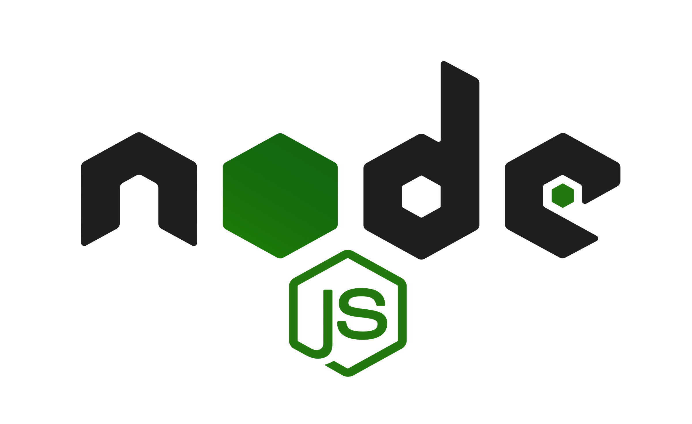

# Dmytro Shvydenko

<!-- img tech -->
  
 
 
 
 

## Experience

1. SOFTPRO: Ukraine, city Kyiv
 DevOps engineer oct. 2022 - until now
 GitLab, GitLab CI/CD, Linux: Ubuntu, Debian, Kali, CentOS, RedHat,
 Zabbix, Python, EFK/ELK, Docker, docker-compose, Ansible, kubernetes,
 Nginx, NodeJS, PostgreSQL, AWS.

2. TECHEXPERT: Ukraine, city Kyiv
 System Administrator  feb. 2021 - may 2022
 Windows Server, PowerShell, Routing and Switching.

## Education

- 2021-2023
 Kyiv National Economics UniversityKyiv National Economics University
 Bachelor's degree   System analysis

- 2017-2021
 FKISIT DVNZ "KNEU named V. Hetʹmana"
 Secondary special education   Computer science

## Spoken languages levels

- English - Intermediate

- Ukrainian - Native

- Russian - Fluent

<!-- img lunux -->
  
 
